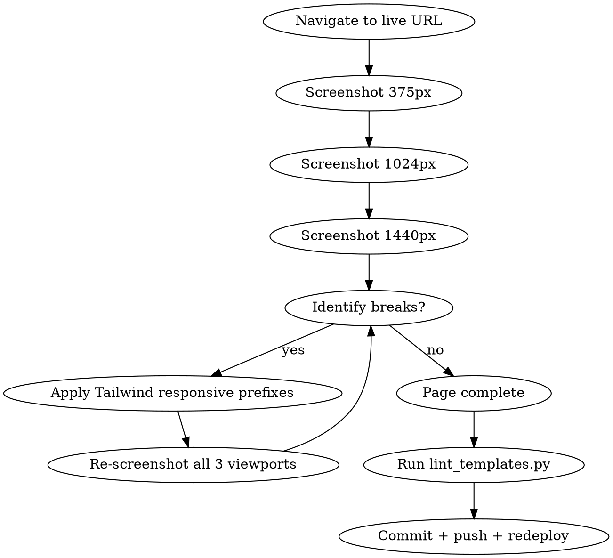

# Public-Pages Responsive Adaptation — Design Spec

**Date:** 2026-05-08
**Status:** awaiting user review
**Goal:** make every public-facing page (the site a non-logged-in visitor sees) render correctly on mobile, tablet landscape, and desktop without breaking the existing visual style.

## Problem statement

The site has been built mostly desktop-first. Recent grep audit:

| File | Total `class=` attrs | Has responsive prefix |
|---|---|---|
| `landing.html` | 321 | 29 (~9%) |
| `pricing.html` | 108 | 4 |
| `auth/register.html` | 74 | 5 |
| `auth/login.html` | 46 | 5 |
| `help/article.html` | 43 | 5 |
| `help/index.html` | 37 | 4 |
| `auth/verify_pending.html` | 23 | 0 |
| `privacy.html` | 22 | 0 |

App pages also need responsive work, but per user decision, this spec covers public pages only. App pages get their own spec later.

User explicitly stated: keep the same visual style — only add responsive variants. No redesign, no new components, no global CSS changes.

## Approach

Playwright-driven snapshot-fix-snapshot loop per page. For each template:

1. Navigate `https://getdoday.ru/<path>` in headless Chromium at three viewports.
2. Inspect screenshots for layout breaks.
3. Apply Tailwind responsive prefixes (`sm:`, `md:`, `lg:`) inline.
4. Re-snapshot to verify fix.
5. Lint (jinja-linter must stay green) and commit.

Three viewports cover the realistic device space:

- **375 × 812** — iPhone SE / iPhone 12 mini / Android phones (most-used mobile)
- **1024 × 768** — iPad landscape / small laptop
- **1440 × 900** — standard laptop / desktop monitor

768px (iPad portrait) and 414px (iPhone Pro) get tablet/mobile fallback for free from mobile-first defaults.

## Pages in scope

8 templates, processed in order of visibility / business impact:

1. `/` — landing.html
2. `/pricing` — pricing.html
3. `/auth/register` — auth/register.html
4. `/auth/login` — auth/login.html
5. `/auth/verify-pending` — auth/verify_pending.html
6. `/help` — help/index.html
7. `/help/<any slug>` — help/article.html (one template, 22 articles use it)
8. `/privacy` — privacy.html

`base.html` is shared but is mostly `<head>` content (SEO, fonts, CSS vars) — no layout to adapt. If during work we identify a shared piece of UI that should move into `base.html` for DRY (e.g., a responsive `.container` utility), we'll do it as a separate commit before the page that introduced the need.

## Workflow per page



Re-snapshot after fixes until all three viewports look correct. Maximum 3 iterations per page — if not converged after 3, escalate as DONE_WITH_CONCERNS to the user with screenshots.

## Common fix patterns

These are the Tailwind patterns we'll be applying. No new patterns — all already in use elsewhere in the project.

| Symptom | Fix |
|---|---|
| Hero `text-7xl` overflows on mobile | `text-4xl md:text-6xl lg:text-7xl` |
| Two-column form-and-side-panel grid breaks at <md | already `md:grid-cols-2`; add `flex-col md:grid` if missing |
| Cards in 4-col grid squashed on mobile | `grid-cols-1 sm:grid-cols-2 lg:grid-cols-4` |
| Button row overflows | `flex flex-wrap gap-3` (instead of `flex gap-3`) |
| Container too wide on mobile | `px-4 md:px-6 lg:px-8` (already standard) |
| Image/SVG overflow | `max-w-full h-auto` |
| Long URL/email breaks layout | `break-words` or `break-all` |
| Sticky nav overflows | `flex-wrap` on nav children |
| Table layout dies on mobile | wrap in `<div class="overflow-x-auto">` |
| Modal too narrow on mobile | `max-w-[calc(100vw-2rem)]` (responsive max-width) |

## Out of scope (explicit)

- App pages (`/app/*`) — separate spec later
- Visual redesign — keep all colors, fonts, gradients, glow effects unchanged
- Component extraction / refactoring — inline Tailwind only
- New breakpoints (Tailwind defaults `sm:640`, `md:768`, `lg:1024`, `xl:1280` are sufficient)
- Container queries — overkill for 8 pages
- Print stylesheet — already exists in `base.html`, untouched
- A11y / WCAG audit — separate concern

## Acceptance criteria

For each page at each viewport (375, 1024, 1440):

1. **No horizontal scroll** — `body` width ≤ viewport width. No `overflow-x: hidden` workaround on body.
2. **All text readable** — primary text ≥11px. Chip/badge text may be 10px with `{# lint-ignore-next-line: small-text #}`.
3. **Touch targets ≥36×36px** for all interactive elements.
4. **Images and SVGs** stay within their containers.
5. **No content cut off** by ellipsis when there's space available.
6. **Layout matches design intent**: stacked on mobile, horizontal on desktop where appropriate.
7. **Jinja-linter stays clean** (no new errors introduced).
8. **Smoke-test stays green** — all 18 endpoints still 200/401.

## Commit strategy

One commit per page. Message format:

```
style: <page-name> — адаптив для mobile/desktop
```

Example: `style: landing — адаптив для mobile/desktop`.

If a `base.html` shared change is needed: separate commit beforehand, message:

```
refactor: <short description> в base.html для адаптива
```

After all 8 pages done: one final commit updating `PROGRESS.md` with summary.

## Testing strategy

- **Per-page screenshot review** — visual confirmation before commit
- **Linter** — `uv run python scripts/lint_templates.py app/templates` after each page; must show 0 errors
- **Smoke-test** — `uv run python scripts/smoke_test.py https://getdoday.ru` after each page is deployed; must show 18/18 green
- **No new automated tests** — visual responsive correctness can't be reasonably unit-tested at this scale

## Rollout

Each page is its own commit + push + redeploy + verify. The user can stop the sprint at any commit and have a half-improved-but-functional site (each commit doesn't depend on later ones).

## Risks

- **Playwright availability**: this approach requires the Playwright MCP plugin. Already verified available in current session.
- **Style drift**: temptation to "improve while I'm here" — explicitly out of scope per user's "тот же стиль". If I see something I want to change beyond responsive, I'll note it in TODO.md and skip it.
- **Real-device differences**: DevTools emulation is approximate. User may find issues on actual phone later. We accept this — TODO list will track real-device feedback.

## Success criteria

A non-logged-in visitor reaching getdoday.ru on a 375px iPhone Safari, 1024px iPad Chrome, or 1440px laptop sees a polished, fully usable site — the same look they'd see on any other device, just adapted to fit.
